# 一致性哈希

## 什么是哈希

哈希是一种将任意大小的数据转换成固定大小的值 (通常是一个数字或字符串) 的过程 . 这个转换后的值称为哈希值或哈希码 . 

### 哈希有以下基本特点

- 确定性 : 同样的输入总是产生同样的输出
- 快速计算 : 哈希函数计算速度通常很快
- 单向性 : 从哈希值很难 (在理论上不可能) 推导出原始数据
- 抗碰撞性 : 很难找到两个不同的输入产生相同的哈希值

> 哈希碰撞指两个不同的输入产生相同的哈希值 . 根据鸽巢原理 , 由于哈希函数将无限的输入空间映射到有限的输出空间 , 碰撞必然存在 , 好的哈希算法应该使碰撞难以被发现或利用 .


### 常见的哈希算法

- MD5 : 输出128位哈希值，现已被证明不安全
- SHA家族 : 
    - SHA-1 : 输出160位哈希值 , 已经不再推荐使用
    - SHA-256 : 输出256位哈希值 , 目前广泛使用
    - SHA-512 : 输出512位哈希值 , 提供更高安全性
- bcrypt/scrypt : 专为密码存储设计的慢速哈希函数
- MurmurHash : 非加密哈希 , 适用于哈希表等数据结构
- CRC32 : 主要用于检测数据传输错误


### 哈希的应用场景

- 数据结构 : 哈希表/字典/映射等数据结构 , 提供 O(1) 时间复杂度的查找
- 数据完整性验证 : 验证文件是否被修改 (如MD5校验)
- 密码存储 : 存储密码的哈希值而非明文
- 数字签名 : 在加密通信中验证消息来源
- 区块链技术 : 用于创建交易的唯一标识和挖矿过程
- 负载均衡 : 如一致性哈希用于分布式系统的负载分配
- 缓存系统 : 确定数据应该存储在哪个缓存节点

### 例子

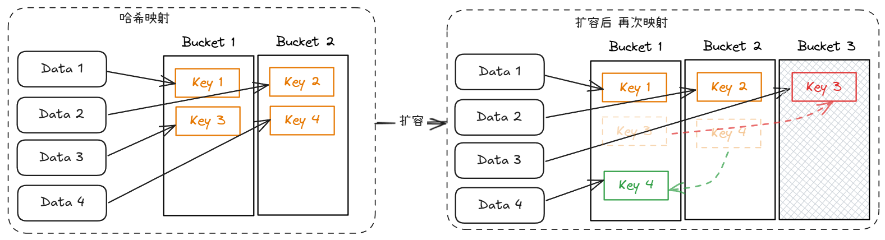

我现在有四个数据 , 分别是 Data1 ~ Data4 , 根据哈希计算出他们分别和 Key1 ~ key4 一一对应 , 如果我有两个 Bucket (哈希桶) , 那么会根据自定义的规则 (哈希值除以 Bucket 的数量 , 然后按余分配到不同的 Bucket ) , 将  hash key 分配到不同的 Bucket 中, 那么每个 key 会按照左侧的方式分布 . 现在进行扩容 (增加一个 Bucket) , 那么 就需要对原有数据进行从新映射 , 部分 key 会重新分布到其他的 Bucket 中 , 如右侧 . 可以看到扩容后 , 原来的 key3 和 key4 为了符合分配规则 ,都进行了相应的移动 .

## 一致性哈希

如果一个哈希算法在扩容后依然能同时满足 **一致性** 和 **均匀性** . 那么这个算法便是一致性哈希 .

- 一致性 : 发生在重新映射的过程 , key要么保留在原来的Bucket中 , 要么移动到新增加的Bucket中 (如上图 红色部分) . 如果key移动到原有的其他 Bucket 中 (如上图 绿色 的移动) . 则不满足 **一致性** 了 .
- 均匀性 : 指key会等概率地映射到每个桶中 . 不会出现某个 Bucket 里有大量key . 某个Bucket里key很少甚至没有key的情况 .

下面是几种常见的例子 : 

- 满足 一致性 , 不满足均匀性 : 
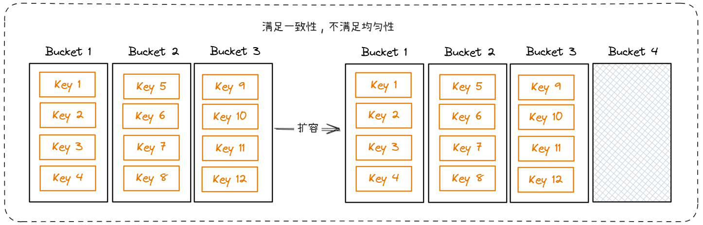

> 增加 Bucket 4 后 , 所有的 Key 仍然保留在原有的 Bucket 中 , 满足一致性 . 但 Bucket 中的 key 分布不均匀 , 不满足均匀性 .

- 满足 均匀性 , 不满足 一致性 : 
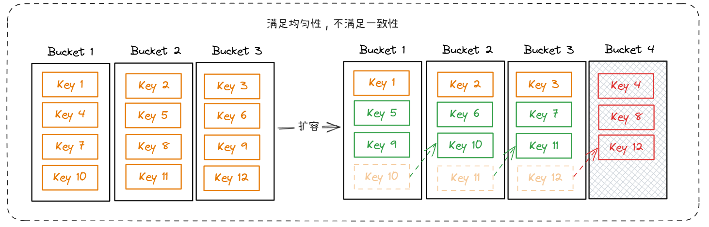

> 增加 Bucket 4 后 , 所有的 key 均匀分布 , 满足均匀性 . 但原有的部分 key 依然在原有的 Bucket 中移动 , 不满足一致性 .

- 满足 均匀性 , 满足一致性 : 
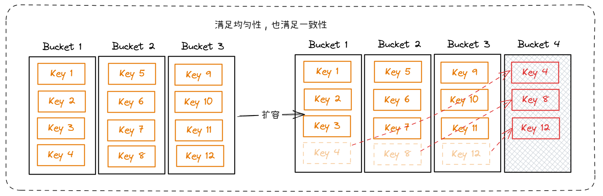

> 增加 Bucket 4 后 , 所有的 key 均匀分布 , 满足均匀性 . key没有在原有的桶中移动 , 满足一致性 .

## 为什么要使用一致性哈希算法

传统哈希算法使用的场景 : 

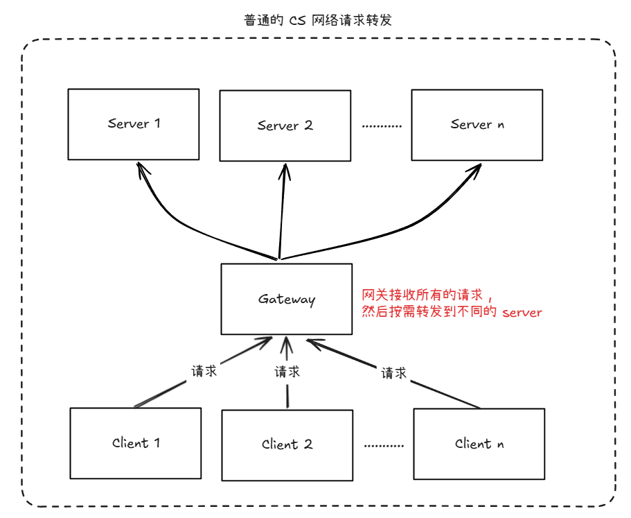

上述的架构很常见 , Gateway 来将不同的数据发送到后方的 Server 上 . 每一个 Server 可以当成 Bucket , 每一个 Client 的请求 , 可以当作一个个具体的 Key . 

> 最简单的方法是使用传统哈希算法 : server_index = hash(client_key) % server_count .

这种方式在服务器固定不变时工作良好 , 但是存在严重问题 : 

### 问题1：服务器数量变化导致大规模重新映射

假设你有5台服务器(S0-S4)，某个key的哈希值是100：
- 100 % 5 = 0，请求路由到S0服务器

如果增加一台服务器变成6台：
- 100 % 6 = 4，请求现在路由到S4服务器

这意味着几乎所有请求的映射关系都会改变！如果服务器上有缓存，这将导致缓存失效率接近100%，引起：
- 缓存雪崩
- 数据库负载突增
- 系统性能急剧下降

### 问题2：负载不均衡

当服务器数量变化时，请求可能会集中到某些服务器，造成负载不均衡。

### 一致性哈希如何解决这些问题

一致性哈希的核心思想是：
- 将服务器和数据映射到同一个哈希环上
- 数据的位置由顺时针方向最近的服务器负责处理
- 当服务器数量变化时，只有部分数据需要重新映射


## 如何实现一致性哈希算法

我还是举例子来解释 : 

假设我们有一个列表 : `[200, 250, 300, 400, 500, 530, 600]` . 每一个数字代表了一种购物套餐方案 . 我们想要一选择一个套餐 , 便宜的套餐质量太低 , 优质套餐价格又太贵 . 因此我们只能在给定的列表内寻找一个 **符合我期望** 或 **比我期望略高但是差距最小的套餐** .

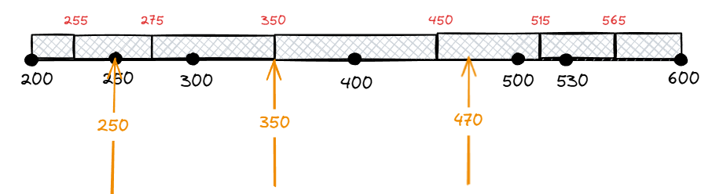

> 可以根据题意作图 , 只要我的预期值在套餐的阴影区域内 , 那么当前套餐就是最优方案 .

- 假设我的期望是 250 . 而正好有一个套餐卖 250 , 因此我最好的选择是 250 的套餐 .
- 假设我的期望是 350 . 它在 300 与 400 正中间 , 因此我最好的选择是 300 的套餐 .
- 假设我的期望是 470 . 那么我最好的选择是 500 的套餐 .

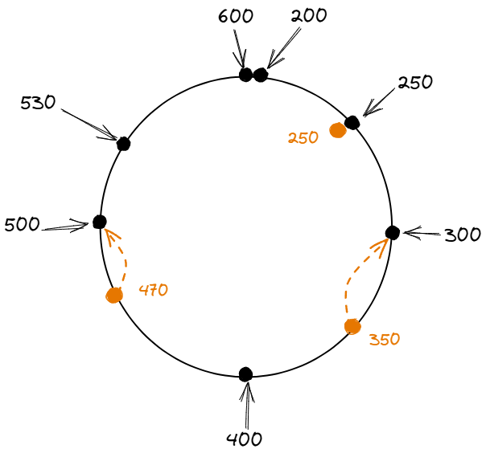

> 我们将上面的 线段 首尾相连组成一个圆环 .

接下来把我们可以根据场景变化来做出当下的选择 : 

1. 现在 500 的套餐被买走了.列表变为 `[200, 250, 300, 400, 530, 600]`.因此最适合我的是 530 的套餐 .
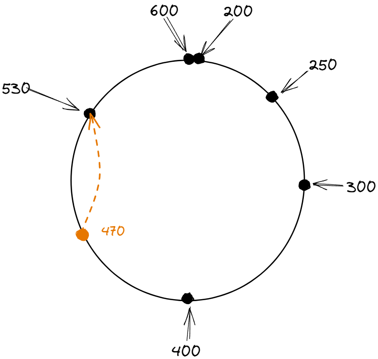

2. 如果 250 的套餐被买走了.列表变为 `[200, 300, 400, 500, 530, 600]`.**对我没有任何影响**.依然是 500 的套餐 .
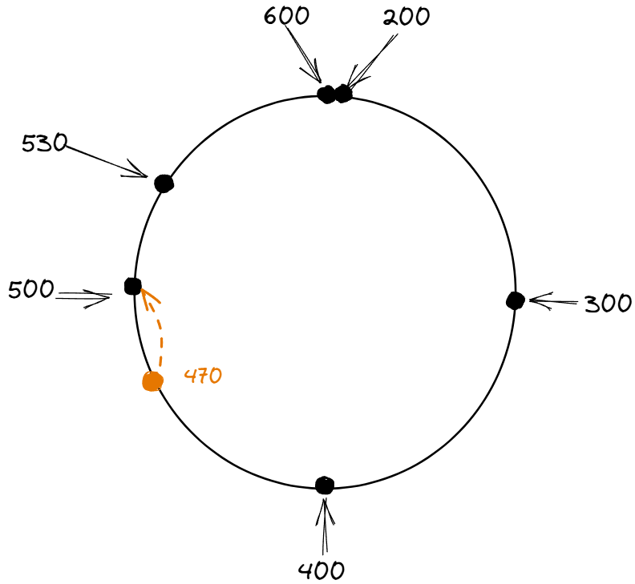

3. 如果添加了一个 480 的套餐.列表变为 `[200, 250, 300, 400, 480, 500, 530, 600]`.我的选择变为 480 的套餐 .
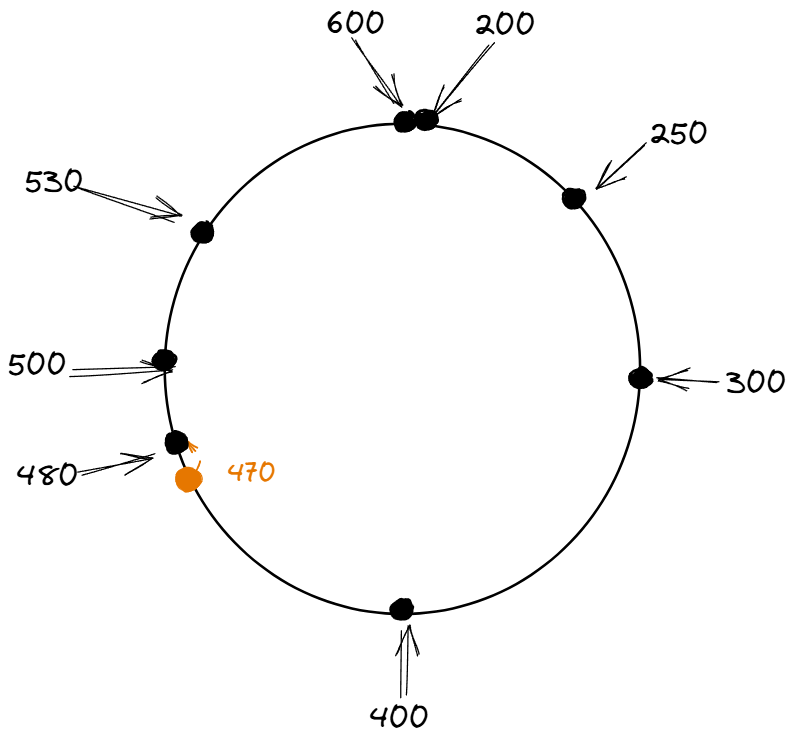

4. 如果添加了一个 240 的套餐.列表变为 `[200, 240, 250, 300, 400, 500, 530, 600]`.**对我没有任何影响**.依然是 500 的套餐 .
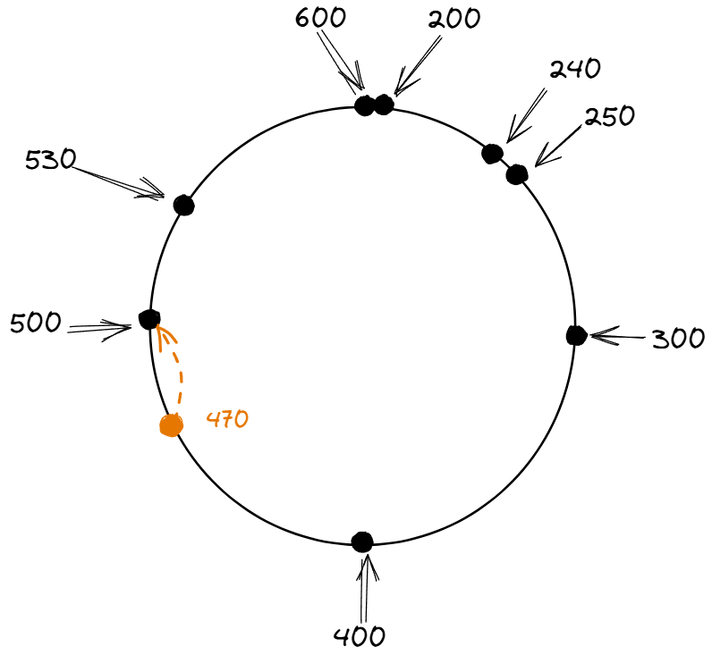

面对这个场景 , 我们便可使用 **二分偏左算法** 来实现 : 

``` java
public int binarySearchLeft(int[] sortedArray, int target) {
        int low = 0,high = sortedArray.length-1;
        while (low <= high){
            if(low + 1 == high){
                int completeValue = (sortedArray[high]-sortedArray[low]) >>> 1 + sortedArray[low];
                if(completeValue >= target)
                    return low;
                else
                    return high;
            }
            int mid = ( low + high ) >>> 1;
            if( sortedArray[mid] < target)
                low = mid;
            else
                high = mid;
        }
        return -1;
    }
```


  
根据上面的例子 , 我们来回归到实际问题中来 , 现在有三个 Redis 节点 , 我们如何设计一套算法将数据分别存入其中 .
- 由于 Redis 各个节点主要是 IP 不同 , 那么我们可以将 IPv4 的取值范围定义一个 环 (IP 环) . 也就是从 0 ~ $2^{32}$ 的范围 . 而我们的三台 Redis 节点根据其 IP 值刚好可以分配到环上的 三个节点 (Node1、Node2、Node3)
- 我们计算需要存入数据的哈希值 , 然后对 $2^{32}$ 取模 , 其结果也会在环上 . 那么我们便将该结果存入环上 **顺时针** 找到的第一个节点中 .
- 根据该算法 . 可知 Object A ——存入——> Node1 ;  Object B ——存入——> Node2 ; Object C ——存入——> Node3 ; 如下图所示 .

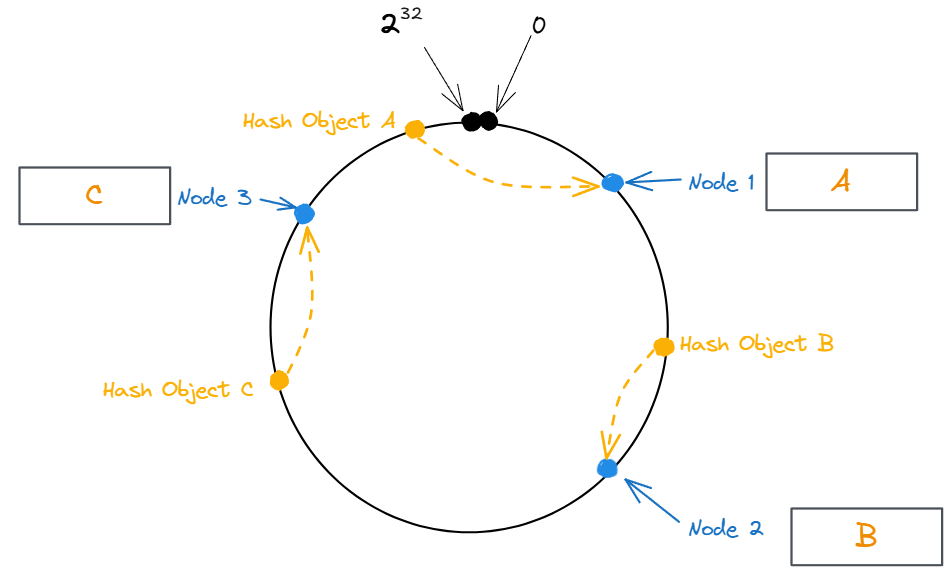

### Bucket删除
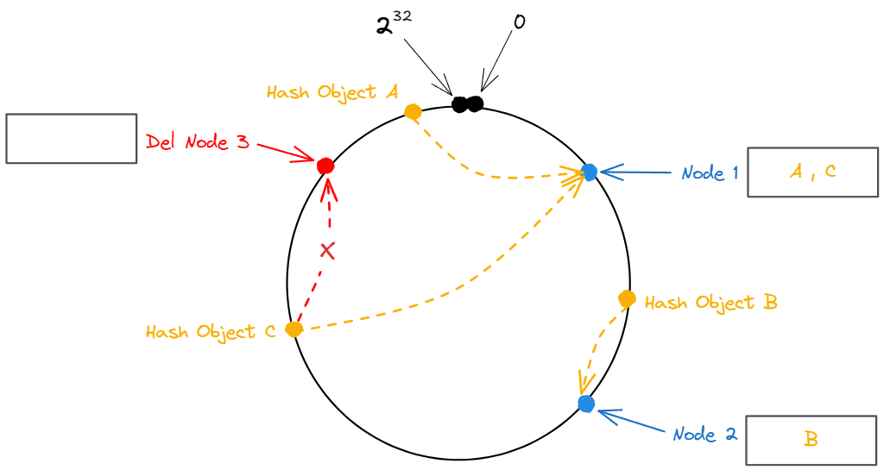

> 当 Node 3 节点被删除.只需要将其数据迁移到 下一个节点 也就是 Node 1 上.这样后续查询 Object C 对象.便可映射到 Node 1 节点中.而无需修改 Node 2 节点的数据 .

### Bucket扩容
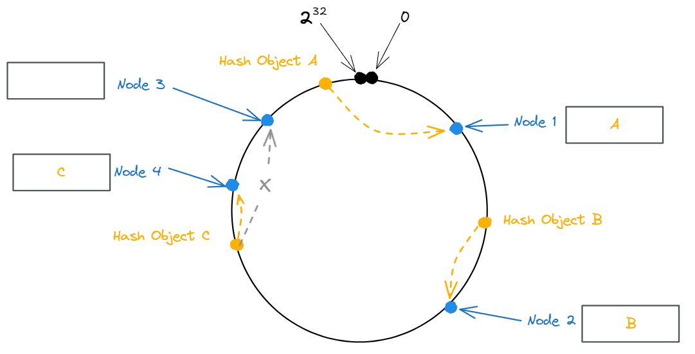

> 当添加 Node 4 节点时.只需要将 Node 3 节点的部分数据迁移到 Node 4 中.其他节点的数据无需改变 .

### 数据倾斜

如果节点数太少 , 容易因为节点分布不均匀而造成**大部分数据缓存在某一台节点上** , 入下图所示 .

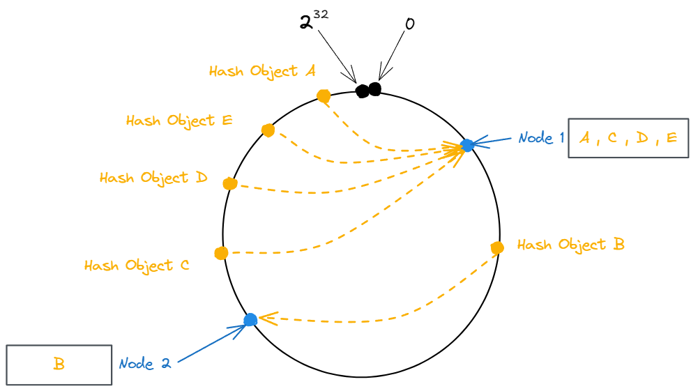

为了解决这一问题 . 该算法可以引入 **虚拟节点** 机制 , 使节点数量尽可能多 , 分配尽可能均匀 . 如下图所示 , 通过添加 Node 1 与 Node 2的虚拟节点 (Node 1 \#1、Node 1 \#2、Node 2 \#1、Node 2 \#2) .来解决数据偏移的场景 .

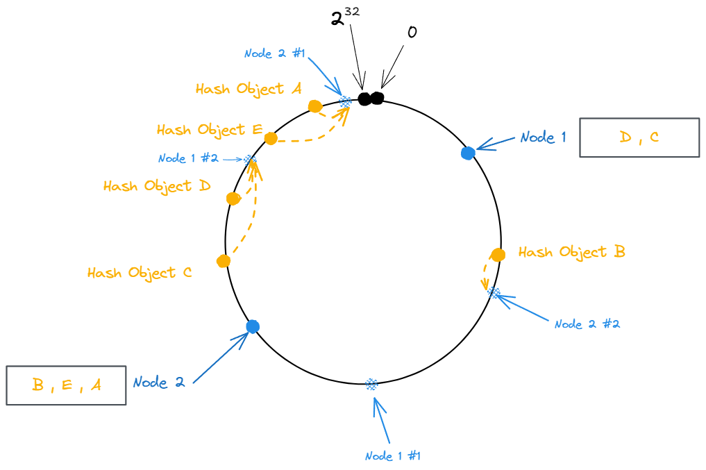


### 代码

``` java
void consistentHashing() {
    //                                  [134744072, 2130706433, 3232235777]
    String[] cacheCluster = new String[]{"8.8.8.8","127.0.0.1","192.168.1.1"};
    Long[] nodes = ipMappingHashRing(cacheCluster);
    //        System.out.println(Arrays.toString(nodes));
    Long key = 2130706434L;
    int index = binarySearchConsistentHash(nodes, key);
    System.out.println("key: "+key+"  need to request node: "+cacheCluster[index]);
}


public int binarySearchConsistentHash(Long[] sortedArray,Long target) {
        int low = 0,high = sortedArray.length-1;
        if(target <= sortedArray[low] || target > sortedArray[high])
            return low;
        while (low <= high){
            if(low + 1 == high)
                return high;
            int mid = ( low + high ) >>> 1;
            if( sortedArray[mid] < target)
                low = mid;
            else
                high = mid;
        }
        return -1;
    }
```


上述便是是在**1997**年由 [麻省理工学院 David Karger 提出的一种分布式哈希 (DHT) 算法](https://dl.acm.org/doi/10.1145/258533.258660) , 也称 **Karger一致性哈希** . 目的是解决分布式缓存的问题 , 现在在分布式系统中有着广泛的应用 .

## 相关衍生

1. Rendezvous Hashing / HRW 算法 : 1996年的论文 [《A Name-Base Mapping Scheme for Rendezvous》](https://www.eecs.umich.edu/techreports/cse/96/CSE-TR-316-96.pdf)中提出 .
2. Jump consistent hash算法 : **Google**于2014年发表的论文[《A Fast, Minimal Memory, Consistent Hash Algorithm》](https://arxiv.org/pdf/1406.2294)中提出 .
3. Consistent Hashing with Bounded Loads算法 : **Google**在2017年发布论文[《Consistent Hashing with Bounded Loads》](https://ai.googleblog.com/2017/04/consistent-hashing-with-bounded-loads.html)中提出 .
4. Maglev Hash算法 : **Google**在2016年发布的论文[《Maglev: A Fast and Reliable Software Network Load Balancer》](https://research.google/pubs/pub44824/)中提出 .


---
可使用 [](https://excalidraw.com/) 工具打开本文的 [原型图文件](attachments/excalidraw.excalidraw)