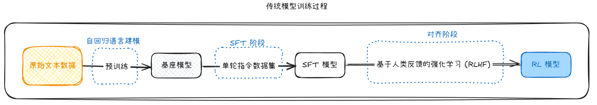
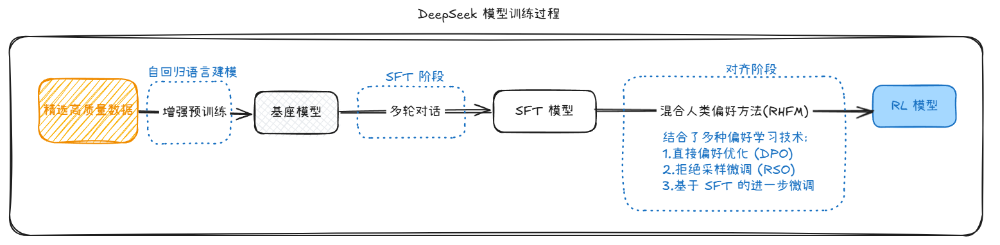

让 DeepSeek 热度暴涨的是 在 2025 年 1月20 日 发布的 [DeepSeek R1](https://github.com/deepseek-ai/DeepSeek-R1 )  

`R1` 是推理模型 , 对标的是 OpenAI 的 o1 ;

`V3` 是通用模型 , 对标的是 OpenAI 的 4o ;

在 [DeepSeek 官网](https://www.deepseek.com/) 上可以与 R1 进行对话 , 点击 `深度思考R1` 便是与 R1 模型对话 , 若不点击 , 则默认是 V3 模型

### 直接展示了推理过程

OpenAI 的 o1 , 不但隐藏了 模型思考的过程 , 甚至是提及 **推理痕迹** 或 Cot (Chain-of-Thought , 思维链) 等词 都有可能导致 封号

DeepSeek R1 的推理会包含大量的反思 和 验证 , 我们在与模型对话时 , 甚至不需要额外引导模型 , 有时还能从模型的思考中学习 .

### 免费使用

OpenAI 的收费比较高 , $20 / 月 , 对 o1 和 o1-mini 的访问次数有限 ; $200/月 才能实现无限访问 ;

DeepSeek 这边直接可以在 App 或 网页上实现免费访问 R1

### 可联网

在使用 OpenAI 的 o1 时 , 是无法使用联网搜索的 , 但是不联网 , 大模型是拿不到实时的资讯 , 因此想问有时效性的问题时候 , 就不能指望 o1 了.

DeepSeek 允许 同时开启 深度思考 和 联网搜索 , 这样可以让 R1 模型结合完善最新的信息进行深度推理

### 成本低

官方没有公开 R1 的训练成本 , 但是很多人会以 V3 为例子 , 它的训练成本是 500W美元 , 而对标的 GPT4 的成本是 10亿美元 ; 并且国产大模型的第一枪 , 也是 DeepSeek 打响的 , 去年的 DeepSeek-V2 发布后 , 国内的 字节 , 阿里 , 百度 等大厂迅速跟进降价

> 性价比比肩最前沿的大模型的同时 成本优势碾压海内外各大厂

### 架构创新

DeepSeek 从 V2 开始 , 就独创了一种全新的 [MLA](https://arxiv.org/abs/2405.04434) (Multi-head Latent Attention , 多头潜在注意力) 架构 , 他魔改了传统的多头注意力 , 把键和值压缩成一个低秩潜在向量 , 来减少内存占用和计算开销 . 梁文峰说到 , 这个创新他们是单独成立了一个 Team 跑了几个月才跑通的 . 但是可贵的不只是这个创新结果本身 , 而是 DeepSeek 对于创新的选择 , 因为创新是不一定能做成的 , 其次是做成后 很容易让追随者躺平 .

### 训练创新

#### 传统模型训练过程 :

- 首先通过 **海量的文本数据**  , 进行 **无监督** (文本没有标注) 预训练 , 目的是 预测下一个词 , 主要依靠 **自回归语言建模** (Autoregressive Model) , 以此得到一个 **基座模型** .

- **监督微调** (Supervised Fine-tuning , SFT) 阶段 , 使用高质量的人工标注指令 , 进行监督训练 , 数据通常是 `指令` -> `回答` , 即我们给模型问题和期望的答案 , 让模型先照着范本学习 ; 目的是让模型学会按照人类的意图来回答问题 , 这个阶段可以显著提升模型的 可用性 和 对话能力 , 以此得到一个 **SFT模型** .

- **对齐** (Alignment) 阶段 , 使用 **基于人类反馈的强化学习** (Reinforcement Learning from Human Feedback , RLHF) , 这儿可以理解为我们让模型自己行动 , 通过打分来告诉它做的好还是差 , 让模型从反馈中学习 . 可以通过 **人工打分** 或通过 **奖励模型** (Reward Model) 来打分 . 这儿主要包含三个步骤 : 
	- 搜集人类对模型回答的偏好数据 .
	- 人工打分 或 配合 奖励模型 .
	- 使用 **PPO** (Proximal Policy Optimization , 近端策略优化) 等 **强化学习算法** 优化模型的输出 .

- 整个过程目的是让模型生成更符合人类偏好的回答 , 更好地对齐人类的价值观和期望 . 最终产出 **RL模型** , 也就是可以部署使用的模型 .

#### DeepSeek-LLM 训练过程

- 使用 2.2万亿 **高质量Tokens** , 并采用更严格的 **数据质量控制** 和 **权重分配** , 以及 效率更高的 **旋转位置编码** 等技术来增强预训练 .

- **监督微调** (Supervised Fine-tuning , SFT) 阶段 , 使用完整的对话历史作为训练数据 , 数据通常是 数据通常是 `指令1` -> `回答1` -> `指令2` -> `回答2` -> `...` 这一组组完整的对话 , 强化了在长对话中保持一致性的能力 , 让模型学习跟踪和理解整个对话线程 , 增强了模型表达中间推理步骤的能力 , 这也是 R1 会给出自己 **思维链** 的原因之一 .

- **对齐** (Alignment) 阶段 , 使用 **混合人类偏好方法** (RHFM) , 摒弃了单一的 **RLHF** , 并集成了多种技术 :
	- 直接偏好优化 (DPO)
	- 拒绝采样优化 (RSO)
	- 基于 SFT 的继续微调

- 整个 **对齐** 阶段更好的平衡了创新性与安全性 , 并且在 混合人类偏好方法中 , 包含了对 **思维链** 的偏好训练 .
   

主要区别：

- 简化流程

- 不需要训练单独的奖励模型

- 不需要复杂的 **PPO** 训练过程

- 直接用偏好数据对模型进行优化

效率提升

- 训练速度更快

- 计算资源需求更少

- 避免了 **RLHF** 中的稳定性问题

数学原理

- DPO ((Direct Preference Optimization , 直接偏好优化) 通过数学推导，将 RLHF 的目标转化为更简单的形式

- 直接优化模型使其输出更可能是偏好选项而不是被拒绝选项

---

可使用  工具打开本文的 [原型图文件](attachments/excalidraw.excalidraw)