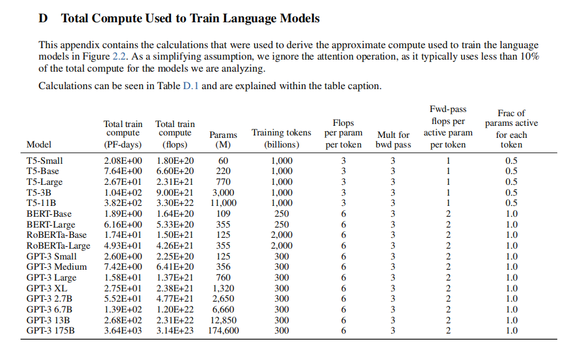
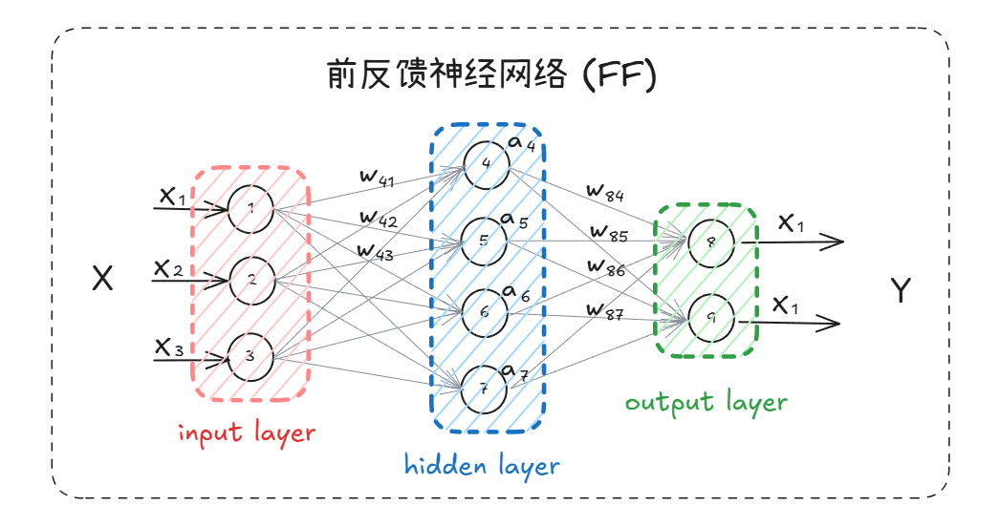
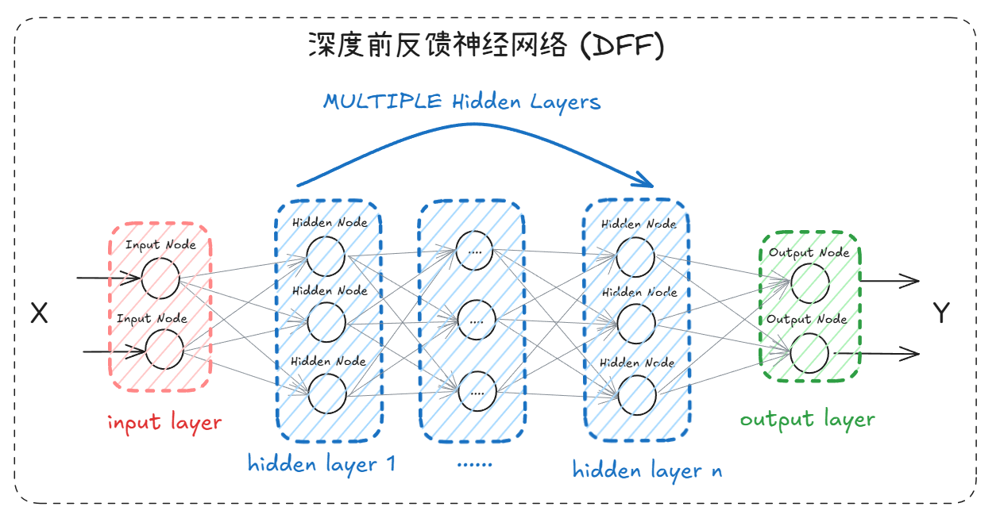
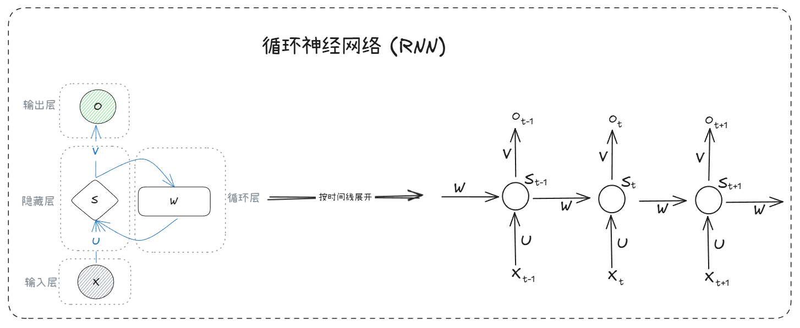
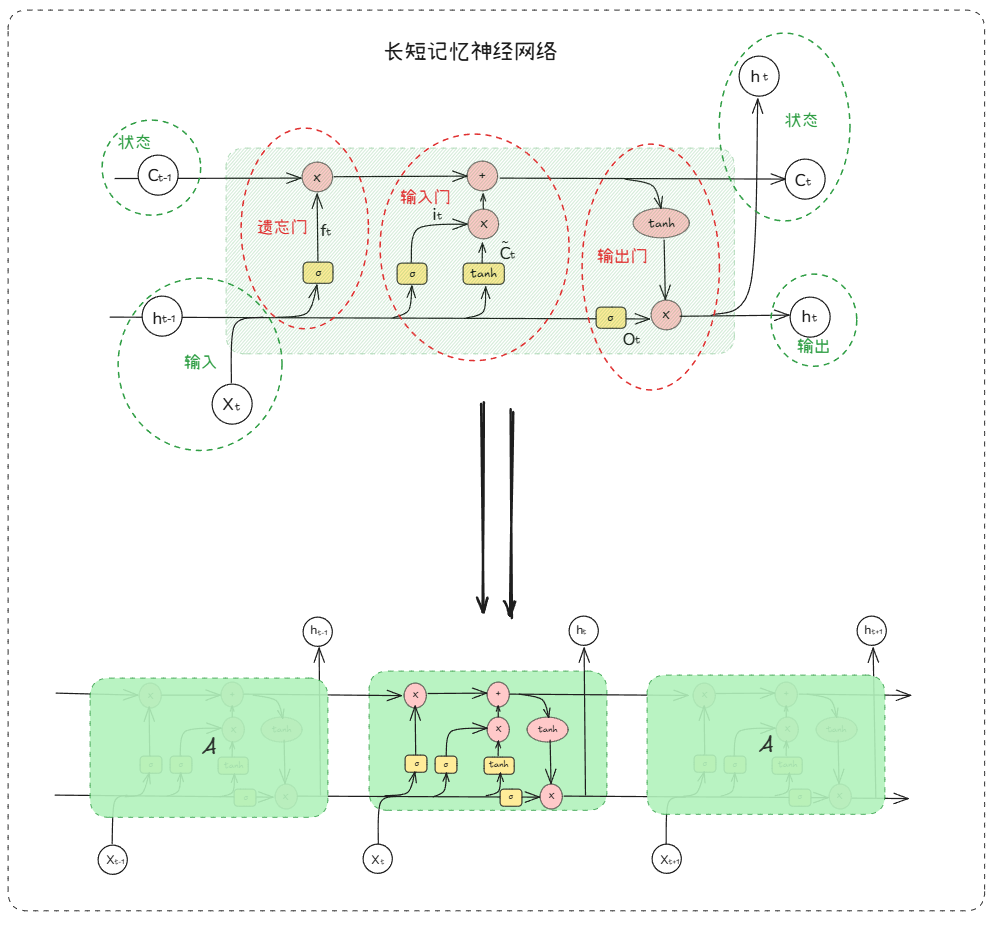
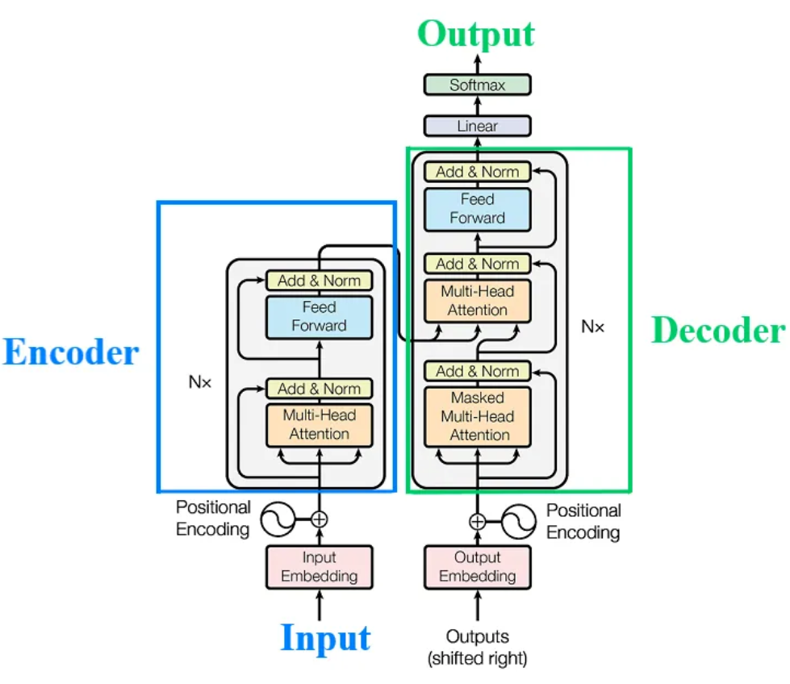
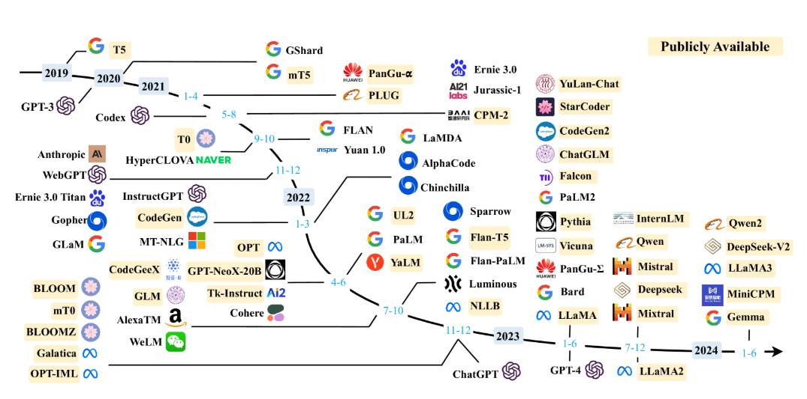

### LLM

**大语言模型** (Large Language Model , LLM) 主要是基于 **自然语言处理** (NLP) 任务的 **神经网络** 模型统称 , 简单可以理解为 : *给模型一些文本类型输入 , 他会返回相应的文本输出* .

#### 训练文本大

首先需要通过 **大量文本** , 进行 **无监督学习** , 借助海量的数据进行 **自回归语言建模** (Autoregressive Model), 使模型能更多了解单词与上下文之间的关系 , 并生成更准确的预测 .

#### 参数多

但是大语言模型的大 , 不仅仅是训练数据的巨大 , 同样也是 参数 (模型内部的变量) 的巨大 , 参数决定了模型 如何对输入数据做出反应 , 从而决定了模型的行为 .

参考研究数据 [Language Models are Few-Shot Learners](https://arxiv.org/abs/2005.14165) 可以看到 GPT-3 175B 模型参数都达到了 1746亿 .

大模型参数种类的繁多 , 也让大模型不像小模型一样只能局限于某一个单项 或 某几项任务 , 而是具有更加广泛的任务 .

#### GPT

大模型的里程碑之一 , 便是 Google 在 2017年的 [Attention Is All You Need](https://arxiv.org/abs/1706.03762) 这篇论文 , 提出了 **Transformer** 模型的概念 , 从而让各种大模型 雨后春笋 涌出来了 , 基于 **Transformer** 架构的模型 , 后续称之为 **GPT** (Generative Pre-trained Transformer) .

随后 **Transformer** 以及它的变体 , 便广泛应用在各个数据集上来训练大语言模型了 .

一直到2022年11月 **ChatGPT** 直接向用户开放 , 并且能在网页上丝滑的交互 , 这才真正走入公众的视野 , 也成功在 5天内 累计 100百万 线上用户 , 这也就是 我们所认识的 LLM .

再到后续的 国产 大模型 [DeepSeek](../DeepSeek/DeepSeek.md) 以多种优势 , 再次成为了 大模型历史上的里程碑 .

### 神经网络

**LLM** 本质上就是一种 巨型神经网络 , **神经网络** 从最简单的 **前馈网络** , 到 **RNN** , **LSTM** , **GRU** , 再到引入 **注意力机制** , 每一步演进都是为了解决语言处理中的特定挑战 . 这一演化路径最终导向了 **Transformer** 架构的诞生 , 而 **Transformer** 又成为构建大语言模型的基石 . **LLM** 并非凭空出现 , 而是 **神经网络** 技术在 **自然语言处理** (NLP) 领域几十年发展的必然成果 , 而这条路径上的每个里程碑都为大语言模型解锁了新的能力维度 .

> 神经网络 也只是一种 广泛的 机器学习 方法 , 有几十年的历史

- 提出并发展 神经网络 技术 (1940年开始概念化 , 1980年开始实用化) 
- 将神经网络应用与 NLP 领域 (1990年 ~ 2000年起步)
- 神经网络在语言模型中取得突破 (2010年)
- Transformer 架构革新 (2017年)
- 规模化训练产生 LLM (2018年 ~ 今)

可以这样类比的理解 , **神经网络** 相当于 `发送机` , **NLP** 相当于 `交通运输领域` , LLM 相当于 `现代超级跑车` , 因此为 **LLM** 是 **神经网络** 技术在 **NLP** 领域规模化应用的产物 . 

#### 前反馈神经网络

#### 深度前反馈神经网络

深度前反馈网络是使用多个隐藏层的前反馈网络 , 只用一层隐藏层的主要问题的 **过拟合** , 因此通过增加隐藏层来减少拟合 , 提高模型的泛化能力 .

#### 循环神经网络

> X 是一个向量 , 表示输入层的值
> 
> S 是一个向量 , 表示隐藏层的值 (其实是多个隐藏层节点 , 节点数与向量 S 的维度相同)
> 
> O 是一个向量 , 表示输出层的值
> 
> U 是输入层到隐藏层的权重矩阵
> 
> V 是隐藏层到输出层的权重矩阵

**循环神经网络** (Recurrent Neural Networks , RNN) , 是众多神经网络的一种 , 是 [**前反馈神经网络**](# 前反馈神经网络) 的一种改进形式 . 在这种类型中 , 它通过在时间上展开来处理序列数据中的依赖关系 . 在每个 **时间步** (time step) , RNN 都会接受一个输入 (文本中的一个 Tokens) , 并输出下一个结果 (下一个 Tokens 的预测) , **RNN** 在每个 **时间步** 都会保留一个 **隐藏状态** (hidden state) , 这个隐藏状态包含了之前所有 **时间步** 的信息 , 并用于计算当前 **时间步** 的输出和下一个 **时间步** 的隐藏状态 .  因此可以利用这种能力 , 正在解决语音识别 , 语言模型 , 机器翻译 , 以及时许分析 等 **NLP** 领域的问题时有所突破 .

因此 **RNN** 的特点是 : 
- 对具有序列特性的数据非常有效
- 能挖掘数据中的时许信息 以及 语义信息

架构按顺序逐次处理 , 每一次的输出取决于上一层的 隐藏状态 和 当前的输入 , 也就是说要等上一步完成后 才能进行当前层的计算 , 下面便是 **RNN** 的缺点 :
- 计算速度慢
- 无法并行计算
- 无法处理长文本
- 层越多 , 前面的影响对后面的影响越弱

与普通 **神经网络** 类似 , **RNN** 的优化也是使用的方向传播 , 不过是带时序的版本 , 与普通反向传播算法一样 , 它重复的使用 **链式法则** , 区别在于损失函数不仅依赖于当前的输出层 , 一依赖于下一层 . 因此参数 W 在更新梯度时 , 必须考虑当前时刻的梯度 和 下一时刻的梯度 , 而在计算梯度时 , 当前时刻的导数会传播到 t-1 , t-2 , 等时刻 , 因此就有了连乘的系数 , 连乘一直带来了两个问题 : **梯度爆炸** 和 **梯度消失** . 而且在向前过程中 , 开始时刻的输入对后面时刻的影响越来越小 , 这就是长距离依赖带来的问题 , 这样依赖 **RNN** 就失去了 **记忆** 能力 . 为了缓解这些问题 **LSTM** 便应运而生 .

#### 长短期记忆

> 通过 `门` 结构来 删除 或 增加 信息到 **细胞状态** (cell state) 中 , 这个 **细胞状态** 承载这事前所有的状态信息 , 每到新的时刻 , 就有相应的操作来决定舍弃什么旧信息 , 以及添加什么新的信息 , 这个状态与 **RNN** 隐藏层状态 S 不同 , 在更新过程中 , 它的更新是缓慢的 , 而 **RNN** 隐藏层状态 S 的更新是迅速的 .

**长短期记忆** (Long Short-term Memory , LSTM) 网络 . 当中引入了一个记忆单元 , 他们可以处理间隔记忆的数据 , 通过每层不但处理当前层的数据 , 还会携带了靠前层的特征 . 能够有效缓解长序列问题中可能出现的 **梯度爆炸** 或 **梯度消失** 但是也无法完全杜绝这种现象 , 只是在更长的序列问题上表现优于传统的 **RNN** . 但是 **LSTM** 内部结构相对复杂 , 因此训练效率在同等算力下较传统 **RNN** 低很多 , 也同样有为解决的问题 :

- 无法并行计算
- 无法处理长文本

> 依旧 只能训练小型模型 , 但是模型对特征的处理有明显改善

后面还有 **门控循环单元网络** (Gated Recurrent Unity , GRU)  架构 也是在 RNN 架构上的改良 , 用于处理序列数据 , 如自然语言处理和时间序列预测等任务 , GRU 和 LSTM 的主要区别在于它们的结构和门控机制 .

#### Transformer

参考 [Transformer 论文解析](https://news.cafa.edu.cn/MobileNews/independenWeixinContent?contentId=225329199) 可看到 模型执行 的动图 

参考 [Attention Is All You Need](https://arxiv.org/abs/1706.03762) 论文 可以看到文中提到的 **Transformer** 架构图

> **Transformer模型通过词嵌入 , 位置编码 , 多头注意力 , 残差连接和前馈网络等组件**  , 实现了对输入序列的高效编码和输出序列的生成 . 
> 
> Input Embedding : 编码器和解码器是Transformer模型的两个主要组件 . 编码器将输入序列 (通常是单词序列) 转换为词嵌入 , 并捕获其中的语义信息 . 解码器则使用这些信息来生成输出序列 . 在Transformer中 , 解码器的初始输入可能是一个特殊的起始标记或编码器的某些输出 , 而不是传统意义上的 "输出集成" .  序列的顺序 (句子中单词的位置) 信息非常重要 , 由于没有循环 (因为在RNN中 , 单词是一个接一个处理的 , 处理是顺序的 , 所以我们可以知道单词的位置 , 而Transformer是并行和非顺序的)  , 这个序列中绝对 (或相对) 位置的信息是通过使用正弦/余弦 "位置编码" 来表示的 . 
> 
> Positional Encoding : 由于Transformer模型是并行处理的 , 它不像RNN那样依赖顺序处理来捕捉位置信息 . 因此 , 需要添加位置编码来确保模型能够理解序列中单词的顺序 . 多头注意力方法允许从不同头计算和捕获相关信息 , 也就是说 , 输入句子中所有单词的注意力分数都被计算出来 . 
> 
> Multi-Head Attention : 多头注意力是Transformer的一个关键组成部分 , 它允许模型同时关注输入序列中的多个不同位置 . 这有助于捕获更丰富的上下文信息 . 残差连接是将输入添加到子网输出以优化深度网络的一种简单方法 , 整个网络使用残差连接 , 并在层上应用加法和归一化 (使用层归一化)  . 
> 
> Add & Normal : 残差连接有助于解决深度神经网络在训练过程中的梯度消失或爆炸问题 , 从而提高模型的性能 . 掩蔽多头自注意力与多头注意力相同 , 但注意力仅针对输出句子 , 当前预测的单词以及输出句子的前一个单词进行计算 (在RNN中 , 输出句子的单词是一个接一个预测的 , 这是解码器的本质)  . 这个将在后面详细解释 . 
> 
> Feed Forward : 前馈网络增加了模型的非线性 , 有助于捕获更复杂的模式 . 在Transformer中 , 这些前馈网络被添加到多头注意力机制之后 , 进一步增强了模型的表示能力 . 
> 
> Masked Multi-Head Attention : 这里描述的是解码器在生成输出序列时使用的自注意力机制的一个特定方面  , 即它如何关注当前预测的单词和之前已经生成的单词, 即在预测下一个词语时 , 只使用前面的词作为上下文 , 因此叫做 带掩码的多头自注意力 .  编码器和解码器的每一层都包含一个全连接前馈网络 (ffn)  . 这由两个线性变换组成 , 这两个变换之间有一个ReLU激活函数 . 在基本的Transformer中 , 输入和输出的维度是dmodel = 512 , 隐藏层的维度是dff = 2048 . 
> 
> Linear & Softmax : 简单理解为 将解码器的输出表示 转换为词汇表的概率分布 , 这个词汇表的概率分布 , 代表了下一个被生成 Token 的概率 , 在大多数情况下 模型会选择 概率最高的 Token 做为概率输出

> 仅编码器/自编码器模型 : Encoder-Only / Autoencoding Module , 例子是 BERT , 用例 : 掩码语言建模 , 情感分析
> 
> 仅解码器/自回归模型 : Decoder-Only / Autoregressive Model , 例子是 GPT-2 , GPT-3 , 用例 : 文本生成
> 
> 编码器-解码器/序列到序列的模型 : Encoder-Decoder / Sequence-To-Sequence Model , 例子是 T5 , BART , 用例 : 翻译 , 总结

这个时候 **Transformer** 出现了 , 它摒弃了传统的循环与卷积操作 , 而完全基于 **注意力机制** , 它允许模型在生成当前词的表示时 , 不仅思考当前位置的信息 , 还能充分考虑整个输入序列所有词的上下文信息 , 并对其进行甲酸融合 , 这样使得 , 模型可以更好的捕捉词语之间的依赖关系和长距离依赖 , 并且注意力机制的计算效率通过使用矩阵运算和并行计算得到条 . 因此使得模型更易于并行化 , 并且训练时间大大减少 . 除此之外 , **Transformer** 还结合了 **残差连接** (Residual Connections) 和 **层归一化** (Layer Normalization) 技术 , 这两种技术的引入极大提升了模型训练的稳定性和收敛速度 .

**Transformer创始八子 : 聚是一团火 , 散是满天星 . **

- Jakob : 提出用自注意力机制替换 RNN的 想法 , 并开始评估 .
    
- Ashish 与 Illia : 设计并实现了第一个 Transformer模型 , 并在工作中发挥了关键作用 .
    
- Noam : 提出了缩放点积注意力 , 多头注意力和无参数位置表示 , 并深入参与工作细节 .
    
- Niki : 在原始代码库和 tensor2tensor 中设计 , 实现 , 调优和评估模型变体 .
    
- Llion : 尝试新型模型变体 , 负责初始代码库 , 以及高效推理和可视化 .
    
- Lukasz 和 Aidan : 设计和实现 tensor2tensor , 取代早期代码库 , 改进结果 , 加速研究 .
    

##### 自注意力机制

**Transformer** 中的层在处理这个 词 本身时 , 还会处理周围的词 以及 所有的词语 , 并且给予每个词 不一样的注意力权重 , 也就是说它每一层都有能力学习输入序列里 所有词的 **相关性** 和 **上下文** . 而每个词语对应的权重 , 是前期通过大量文本 训练习得的 , 因此 模型有能力知道 每个词之间的相关性有多强 , 然后去专注于输入里真正重要的部分 .

##### 位置编码

**Transformer** 的另一项创新是 位置编码 . 由于传统的架构式是 依次处理句子中的每个词 , 因此不能并行处理 , 必须等待上一层处理完毕后 , 才能处理当前层的数据 . 而 Transformer 通过添加了位置编码 , 将数据分成两部分 , 一部分是这个词本身 , 一部分是 这整个句子中每个词的位置 , 将他们合并并把这个结果给神经网络 , 这样 模型既可以理解每个词的意义 , 又能够捕获词在句子中的位置 , 从而理解不同词顺序的关系 , 因此借助位置编码 , 词 可以不按顺序的输入给 Transformer , 模型可以同时处理输入序列里的所有位置 , 那么在计算时 , 每个输出都可以独立计算 , 而不需要像 RNN 那样等待上一层算好后 再处理 .

基于上述两点 , 已经可以解决传统模型中 无法并行计算 与 无法处理长文本 的问题 , 从而使训练大数据量文本 与 长句子文本 变得没那么困难 , 因此以此为架构的 大语言模型 便得以落实 .

Transformer 优点 : 
- 并行处理 : Transformer 能够高效进行并行计算 , 提高了训练速度 .
- 全局信息捕获 : 可以通过自注意力机制捕获全局上下文信息 , 对于这个理解复杂的语言结构至关重要 .
- 长距离依赖 : 通过 自注意力机制 与 位置编码 , Transformer 能够直接捕获任意两个输入位置之间的依赖关系 , 有效解地解决了长距离依赖的问题 .

Transformer 缺点 :
- 计算资源消耗 : 由于自注意力机制涉及到大规模的矩阵运算 , 尤其是全尺寸的注意力矩阵 , 这可能导致 Transformer 在计算和内存资源的需求较高 .

改论文发表后 , 轰动一时 , 各大机构都开始基于 Transformer 架构来构建模型 .

参考 [A Survey of Large Language Models](https://arxiv.org/abs/2303.18223v15) 中提到各种大模型调查可以看到 , 后续的 LLM 模型如雨后春笋的爆发出来 .

---

可使用  工具打开本文的 [原型图文件](attachments/excalidraw.excalidraw)