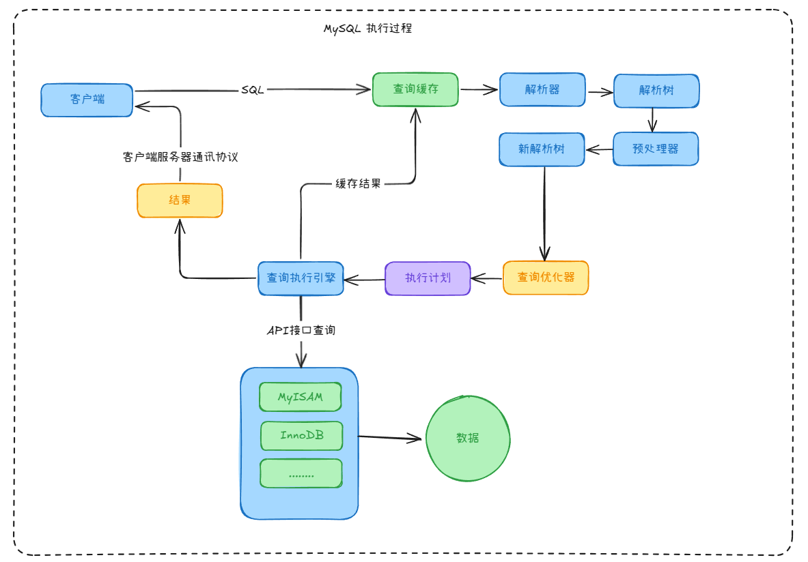

---

id: 3df8875b-0661-4223-a8ef-0e9ca7950f9a
aliases:
  - 3df8875b-0661-4223-a8ef-0e9ca7950f9a
  - MySQL
title: MySQL
created: 2025-03-06T16:25
author: hel10word
status: draft
tags: 
  - status/draft
summary: 这是一段简短的摘要 , 描述文档的主要内容
---

# MySQL

- 索引
    - 聚簇索引 : 索引和数据存储在一棵树上 , 树的叶子节点就是数据
    - 非聚簇索引 : 索引和数据不在一棵树上
- MySQL 默认存储引擎是 InnoDB , 底层采用 B+ 树 , 叶子节点才会存放数据 , 最底层是一个双向有序链表 .
- Hash索引在等值查询效率更高
- B+树支持范围查询 , 联合索引的最左匹配原则 , order by排序等等
- 回表 : 通过普通索引找到相应数据的主键值 , 然后再通过主键值去主键索引里找符合要求的数据 .
- 事务 主要就是需要满足 ACID 原则
    - A 原子性
        - 这点主要是保证一个事务要么执行成功 , 要么执行失败 , 在 MySQL 中是靠 Undo Log 来保证的 , 每次执行数据变更操作时 , 会将还未变更的数据快照到 Undo Log 中 , 然后再进行相应的数据变更 , 若变更失败 , 则会按照 Undo Log 来对数据进行回滚 , 以此可以确保该次数据要么执行成功要么执行失败 .
    - C 一致性
        - 这儿主要是由于上层应用来保证数据的一致性
        - 数据库中也提供了唯一约束 或 主键等技术来保证数据的一致性
    - I 隔离性
        - 四个隔离级别 :
        1. 读未提交 (READ UNCOMMITTED , RU) : 事务还未提交 , 变更就已被其他事务看到
            - 脏读 : 读到未提交事物修改过的数据
            - 幻读 : 一个事务读取2次 , 得到的记录条数不一致
            - 不可重复读 : 一个事务读取同一条记录2次 , 得到的结果不一致
        2. 读已提交 (READ COMMITTED , RC) : 事务提交之后 , 变更才被其他事务看到
            - 不可重复读
            - 幻读
        3. 可重复读 (REPEATABLE READ , RR) (默认级别) : 一个事务执行过程中看到的数据与启动时看到的数据一致
            - 幻读
        4. 串行化 (SERIALIZABLE) : 会对数据加上读写锁
            - 通过 MVCC (多版本并发控制) 来保证胀读和不可重复读 , 通过 行锁 或 表锁 的方式来避免幻读
    - D 持久性
        - MySQL 中主要是通过 Redo Log 来保证 , 每次更改成功的数据 , 并不是直接写入磁盘 , 而是先写入内存中 , 并记录到 Redo Log 里 , 会有单独的线程来将 Redo Log 中的数据写入到磁盘中 , 这样哪怕数据库突然宕机 , 也能从 Redo Log 中恢复相应的数据 .
- 日志
    - BinLog : 属于逻辑日志 , 记录语句的原始逻辑 , 所有存储引擎都有 . 数据库备份 , 主从都离不开 .
    - UndoLog : 回滚日志没用来保证事务的原子性 .
    - RedoLog : 属于物理日志 , InnoDB 存储引擎独有 , 主要用来保证数据的持久性与完整性 .

---
可使用  工具打开本文的 [原型图文件](../KnowledgeMatrix/ComputerScience/Network/网络数据包封装与传输/attachments/excalidraw.excalidraw)

