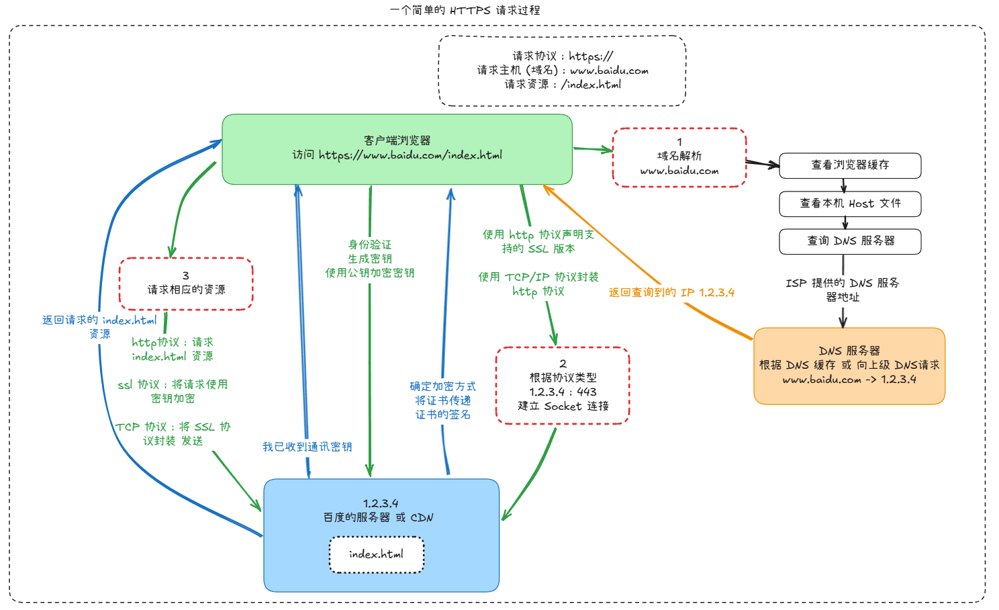

假设你在浏览器中输入网址请求访问网页 : 

1. **发送方 ( 客户端 )  封装过程** : 

   - **应用层** : 生成HTTP请求

   - **传输层** : 添加TCP头 ( 包含源端口和目标端口 )  

   - **网络层** : 添加IP头 ( 包含源IP和目标IP )  

   - **数据链路层** : 添加以太网帧头 ( 包含MAC地址 )  和帧尾

   - **物理层** : 转换为比特流并传输

2. **网络传输** : 

   - 数据经过多个路由器和交换机

   - 每个设备接收到数据后解析到不同层次进行处理

   - 路由器工作在网络层 , 解析IP头进行路由选择

   - 交换机主要工作在数据链路层 , 根据MAC地址转发

3. **接收方 ( 服务器 )  解封装过程** : 

   - **物理层** : 接收比特流

   - **数据链路层** : 验证帧 , 移除帧头和帧尾

   - **网络层** : 检查IP头 , 确认目标地址

   - **传输层** : 检查TCP头 , 确认端口号并重组数据

   - **应用层** : 处理HTTP请求 , 生成响应

---

可使用  工具打开本文的 [原型图文件](attachments/excalidraw.excalidraw)