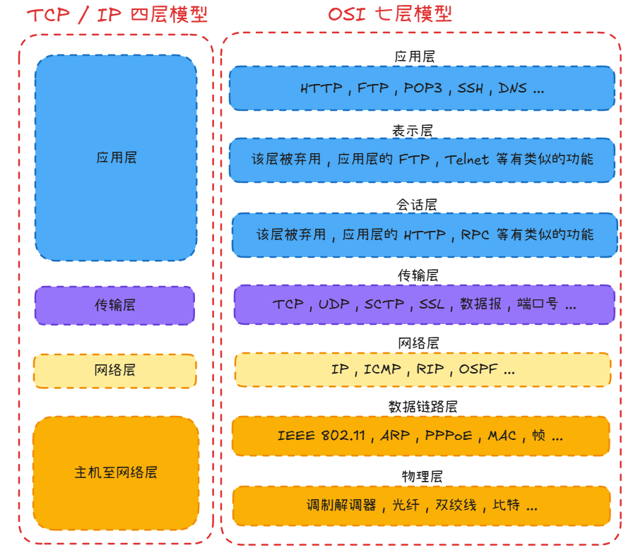
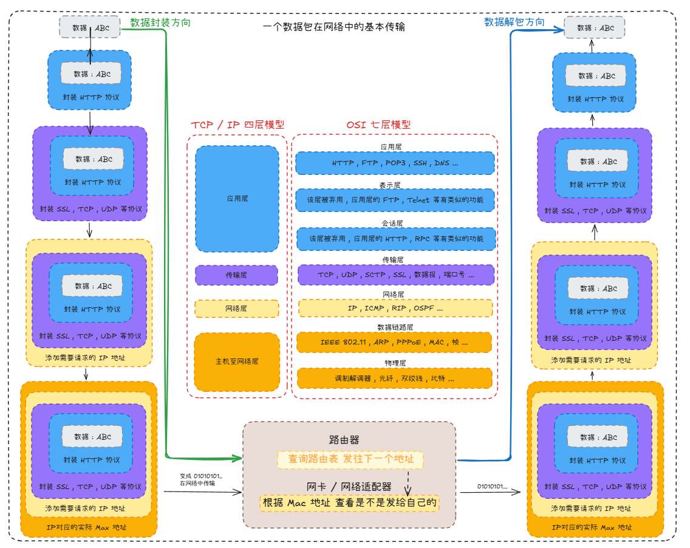

# 网络数据包封装与传输

## 网络模型概述

  

### OSI七层

**OSI模型** ( Open Systems Interconnection Model）是由国际标准化组织 ( ISO ) 提出的一种概念模型 , 将网络通信系统分为七层 . 从上到下依次为 : 

1. **应用层** ( Application Layer ) 

2. **表示层** ( Presentation Layer ) 

3. **会话层** ( Session Layer ) 

4. **传输层** ( Transport Layer ) 

5. **网络层** ( Network Layer ) 

6. **数据链路层** ( Data Link Layer ) 

7. **物理层** ( Physical Layer ) 

### TCP/IP四层

与之对应的是实际应用更广泛的 **TCP/IP四层模型** ： 

1. **应用层** ( 对应OSI的应用层、表示层、会话层 ) 

2. **传输层** ( 对应OSI的传输层 ) 

3. **网络层** ( 对应OSI的网络层 ) 

4. **网络接口层** ( 对应OSI的数据链路层和物理层 ) 

## 数据包封装

数据封装是指 **数据** 在网络中传输时 , 从上层向下层传递的过程中 , 每一层都会在数据的前后添加该层的头部 (有时还有尾部) 信息 . 这个过程类似于在信件外层不断加上新的信封 . 

### 封装过程详解

  
1. **应用层** : 

   - 生成原始数据

   - 数据单位 : 消息 ( Message )  

2. **表示层** : 

   - 负责数据格式转换、加密解密、压缩解压缩

   - 在数据外层添加表示层头部

3. **会话层** : 

   - 建立 , 管理和终止会话

   - 添加会话层头部

4. **传输层** : 

   - 负责端到端的可靠传输

   - 添加传输层头部 ( 如TCP头或UDP头 ) 

   - 数据单位 : 段 ( Segment ) 或数据报

5. **网络层** : 

   - 负责逻辑寻址和路由选择

   - 添加网络层头部 ( 如IP头 ) 

   - 数据单位 : 分组 ( Packet ) 

6. **数据链路层** : 

   - 负责物理寻址 , 错误检测和纠正

   - 添加数据链路层头部和尾部 ( 如以太网帧头部和FCS ) 

   - 数据单位 : 帧 ( Frame ) 

7. **物理层** : 

   - 将数据转换为比特流进行物理传输

   - 数据单位 : 比特 ( Bit ) 

### 发送方数据封装流程

1. 应用程序生成数据 ( 如HTTP请求 )  

2. 数据从应用层向下传递 , 每层添加各自的头部信息

3. 物理层将比特流通过物理介质发送出去

### 接收方数据解封装流程

1. 物理层接收比特流

2. 数据从物理层向上传递 , 每层移除相应的头部信息

3. 应用层最终接收到原始数据

### 示例

[Web浏览器请求网页过程](../Web浏览器请求网页过程/Web浏览器请求网页过程.md)

## 各层协议与数据单元

| OSI层 | TCP/IP层 | 协议示例 | 数据单元 | 寻址方式 |
|-------|----------|---------|---------|----------|
| 应用层 | 应用层 | HTTP, FTP, SMTP, DNS | 消息(Message) | 无特定寻址 |
| 表示层 | 应用层 | SSL/TLS, JPEG, MPEG | 消息(Message) | 无特定寻址 |
| 会话层 | 应用层 | NetBIOS, RPC | 消息(Message) | 无特定寻址 |
| 传输层 | 传输层 | TCP, UDP | 段/数据报(Segment) | 端口号 |
| 网络层 | 网络层 | IP, ICMP, OSPF | 分组(Packet) | IP地址 |
| 数据链路层 | 网络接口层 | 以太网, PPP, HDLC | 帧(Frame) | MAC地址 |
| 物理层 | 网络接口层 | RS-232, 以太网物理规范 | 比特(Bit) | 无寻址(物理信号) |

## 数据封装的重要性

数据封装机制具有以下重要意义 : 

1. **模块化和分层** : 每层专注于特定功能 , 简化网络设计和维护

2. **互操作性** : 不同厂商的设备只要遵循相同的协议标准即可互相通信

3. **灵活性** : 上层协议可以独立于下层实现变更

4. **可靠性** : 各层都有错误检测和恢复机制

5. **安全性** : 可在不同层实施安全措施

## 实际应用中的数据封装实例

### TCP/IP数据包示例

一个完整的TCP/IP数据包从内到外包含 : 

- **数据** : 应用层生成的原始数据 ( 如HTTP请求 )  

- **TCP头** : 包含源端口 , 目标端口 , 序列号 , 确认号等 ( 20字节 )  

- **IP头** : 包含源IP , 目标IP , 生存时间等 ( 20字节 )  

- **数据链路层头尾** : 包含MAC地址 , 类型字段等 ( 约14字节头部+4字节尾部 )  

### 以太网帧最大传输单元

以太网帧的最大传输单元(MTU)通常为1500字节 , 这限制了上层数据的大小 . 当IP数据包超过MTU时 , 会发生IP分片 , 将大数据包分割成多个小数据包进行传输 . 

## 总结

网络数据包的封装与传输是计算机网络通信的基础 . 数据从发送方应用层开始 , 逐层向下添加头部信息 , 通过物理媒介传输到接收方 , 再逐层向上解析直至应用层 . 这种分层机制保证了网络通信的可靠性 , 灵活性和互操作性 . 

## 参考资料

1. [OSI model - Wikipedia](https://en.wikipedia.org/wiki/OSI_model)

2. [Internet protocol suite - Wikipedia](https://en.wikipedia.org/wiki/Internet_protocol_suite)

3. [Computer Networks: A Systems Approach](https://book.systemsapproach.org/)

4. [Transmission Control Protocol - Wikipedia](https://en.wikipedia.org/wiki/Transmission_Control_Protocol)

5. [Internet Protocol - Wikipedia](https://en.wikipedia.org/wiki/Internet_Protocol)

---

可使用  工具打开本文的 [原型图文件](attachments/excalidraw.excalidraw)