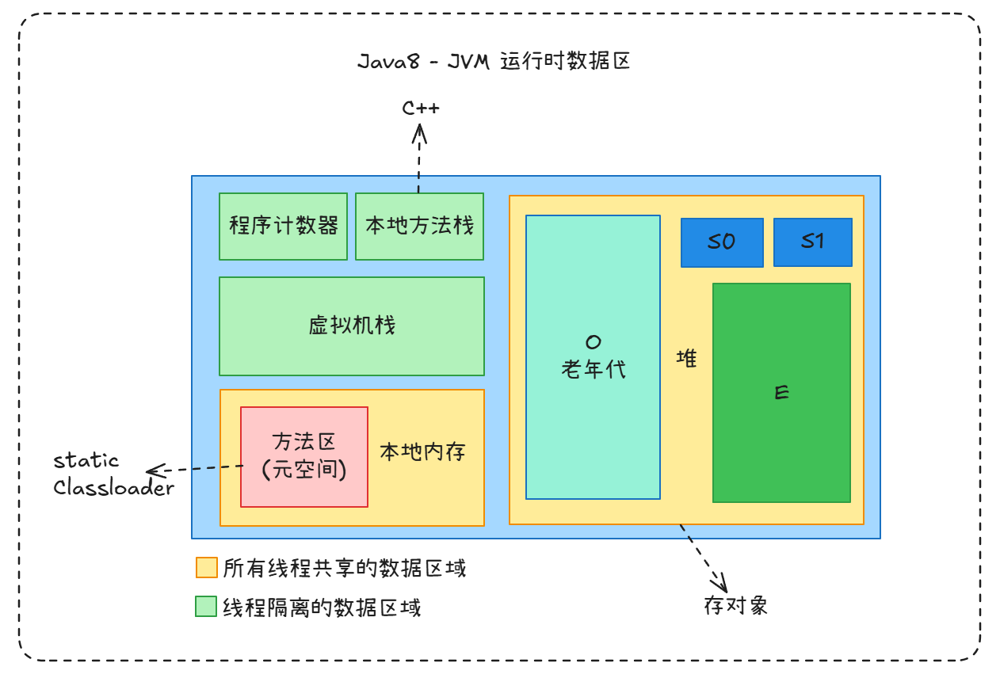

# JVM

- JVM 内存区域
    - 所有线程共享 : 方法区 , 堆
    - 线程独享 : 虚拟机栈 , 本地方法栈 , 程序计数器

- 垃圾回收算法
    - 标记清除法
        - 标记处需要回收的对象 , 然后将其回收
    - 复制算法
        - 将内存分为两块 , 将活着的对象复制到新的内存区域
    - 整理算法
        - 让所有活着的内存对象像空闲的空间的一端移动
    - 分代收集算法
        - 分代收集算法根据**对象存活周期的不同**将堆分成新生代和老生代 (Java8以前还有个永久代) ,默认比例为 1 : 2 , 新生代又分为 Eden 区 , from Survivor 区 (简称S0) , to Survivor 区(简称 S1),三者的比例为 8: 1 : 1 , 这样就可以根据新老生代的特点选择最合适的垃圾回收算法 , 我们把新生代发生的 GC 称为 Young GC (也叫 Minor GC) ,老年代发生的 GC 称为 Old GC (也称为 Full GC)

- 内存分区
    - 新生代 : 存活时间端 , 内部分为 3 个区域 , 8 : 1 : 1
    - 老年代 : 多次 GC 后依然存活的对象

- 触发 GC 的时机

- 垃圾回收器
    - G1
    - GMS : 收集器是一种以获取最短回收停顿时间为目标的收集器 , 同样是老年代的收集器 , 采用标记-清除算法 .

---
可使用  工具打开本文的 [原型图文件](../KnowledgeMatrix/ComputerScience/Network/网络数据包封装与传输/attachments/excalidraw.excalidraw)

