# 神龙架-攻略

## 游玩点

| 景点                      | 成人价格 | 时长    | 4月 ~ 11月   | 12月 ~ 3月   | 特色                                    |
| ------------------------- | -------- | ------- | ------------ | ------------ | --------------------------------------- |
| [神农顶景区](#神农顶景区) | 130      | 4 ~ 12  | 7:00 ~ 16:30 | 8:30 ~ 15:30 | 核心景区 , 登顶 , 金丝猴 , 原始森林     |
| [大九湖](#大九湖)         | 100      | 2 ~ 6   | 7:30 ~ 16:30 | 8:30 ~ 15:30 | 九个不同的山间湖泊 , 湿地 , 鹿苑 , 晨雾 |
| [天生桥](#天生桥)         | 55       | 1 ~ 1.5 | 7:30 ~17:30  | 8:30 ~ 17:30 | 石壁栈道 , 巴人部落                     |
| [神农坛](#神农坛)         | 55       | 1 ~ 1.5 | 7:30 ~ 17:30 | 8:30 ~ 17:30 | 天坛 , 神农牛首人身雕像 , 古树          |
| [官门山](#官门山)         | 95       | 1 ~ 1.5 | 7:00 ~ 17:30 | 8:30 ~ 17:30 | 地质馆 , 石壁蜂箱 , 大熊猫 , 人文介绍   |
| [天燕景区](#天燕景区)     | 45       | 4 ~ 7   | 7:00 ~ 17:30 | 8:30 ~17:30  | 彩虹桥 , 燕子洞 , 画廊谷                |
| 6景区 联合套票            | 299      |         |              |              |                                         |

### 神农顶景区

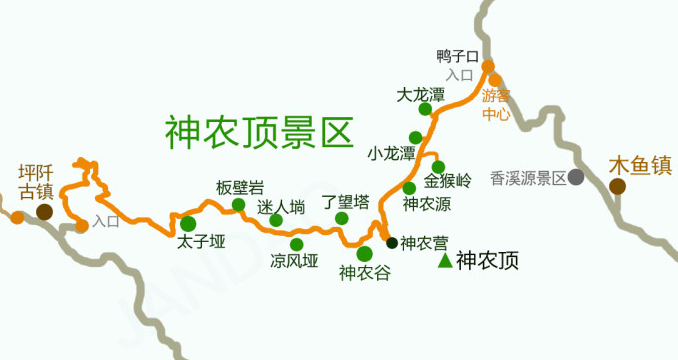

| 途径点 | 游玩时长 | 推荐指数 | 特色 |
| ----------------- | ------- | ---- | ------------------------------------ |
| [大龙潭](#大龙潭) | -       | -    | 神农架研基地 (不对游客开放)      |
| [小龙潭](#小龙潭) | 0.5     | ✨    | 金丝猴救助基地           |
| [金猴岭](#金猴岭) | 1 ~ 2   | ✨✨✨✨ | 上部分环形登山 , 下部分溪流瀑布      |
| [神农源](#神农源) | 0.5     | ✨✨   | 溪流栈道                             |
| [神农顶](#神农顶) | 2 ~ 3   | ✨✨   | 2999 级台阶 , 到 3100 高的华中第一峰 |
| [神农谷](#神农谷) | 2.5 ~ 4 | ✨✨✨✨ | U型路线 , 下到谷底再爬上来 , 距离长  |
| [瞭望塔](#瞭望塔) | 0.5     | ✨✨✨  | 远望神农顶                           |
| [天际岭](#天际岭) | 0.5 ~ 1 | ✨    | 原名凉风垭 , 平台看风景                       |
| [迷人埫](#迷人埫) | 1       | ✨✨   | 高山草甸 , 可欣赏 阴峪河大峡谷       |
| [板壁岩](#板壁岩) | 1       | ✨✨✨  | 天然岩石奇观                         |
| [太子垭](#太子垭) | 1       | ✨✨✨✨ | 林中步道 , 坡度不大 , 空气好         |

#### 金猴岭

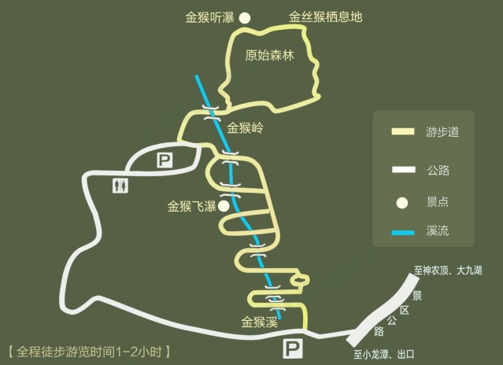

#### 神农源

神农源的溪流来源于 神农架 的最高山脉，此处是南河水系的发源地，从神农顶下山后一路向北，注入野马河后汇入汉江。

#### 神农顶

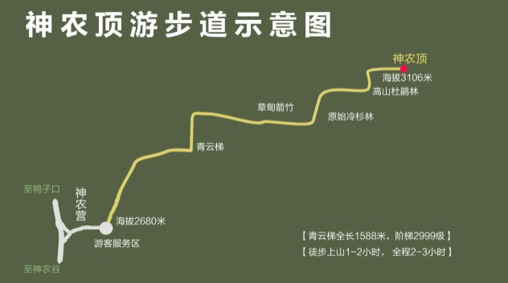

#### 神农谷

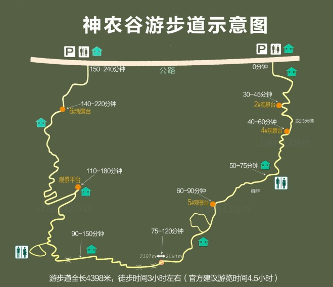

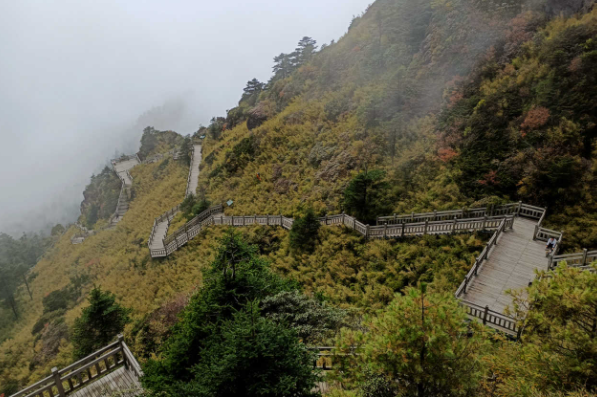

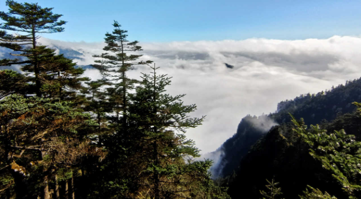

#### 瞭望塔

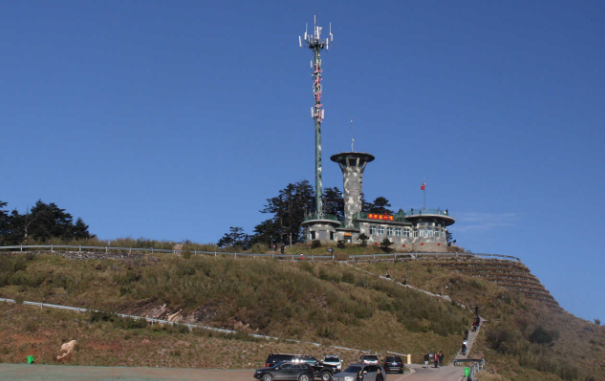

真正的 **神农顶**

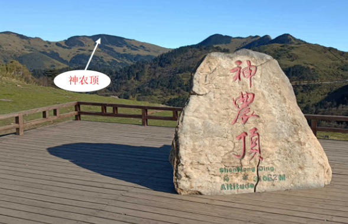

#### 天际岭

#### 迷人埫

#### 板壁岩

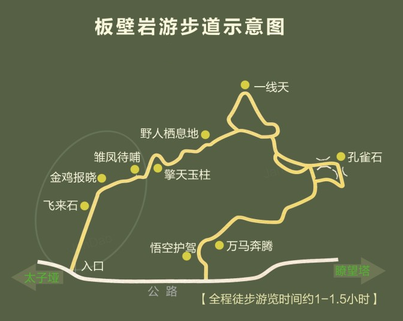

#### 太子垭

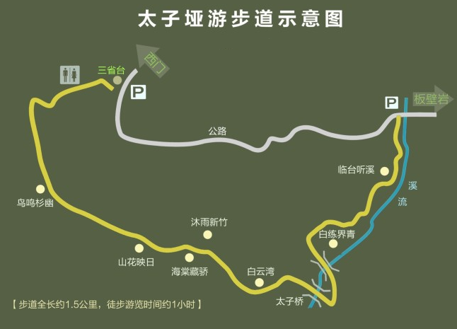

### 大九湖

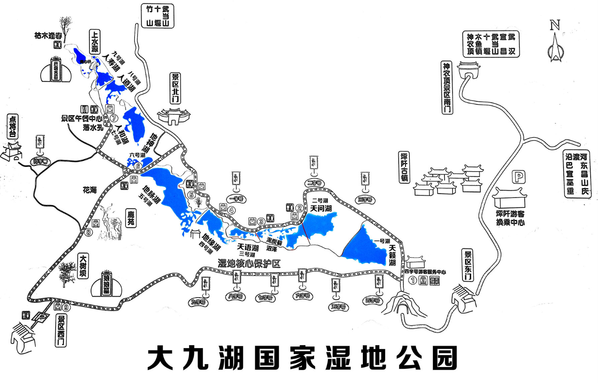

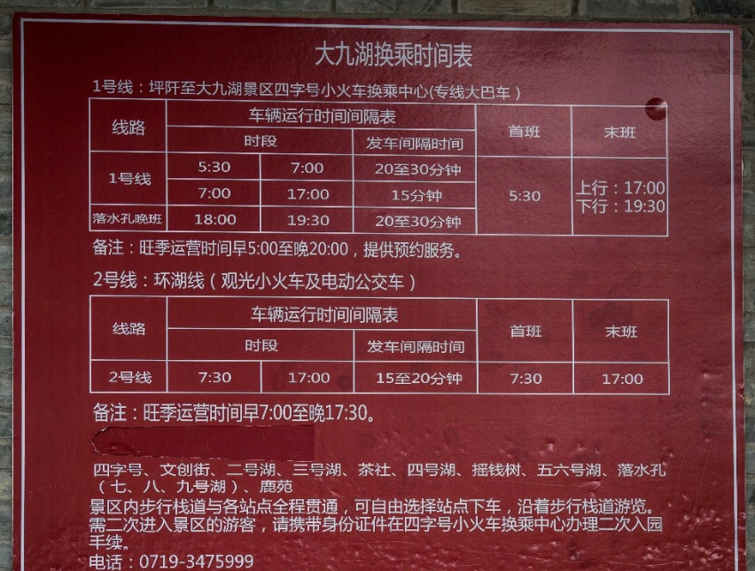

### 天生桥

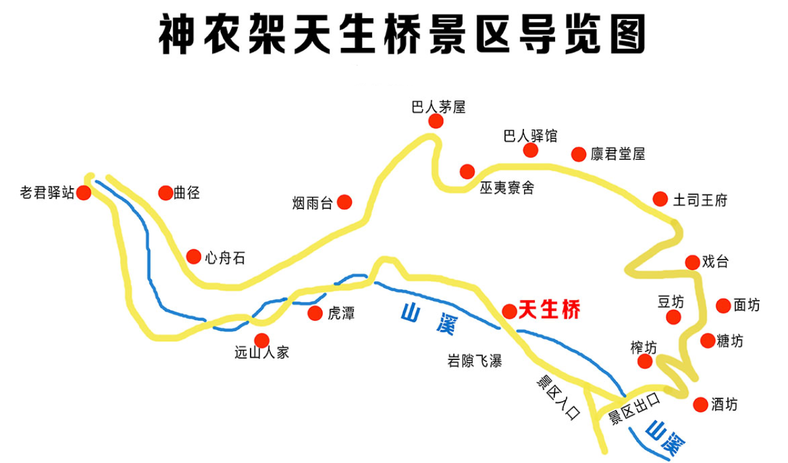

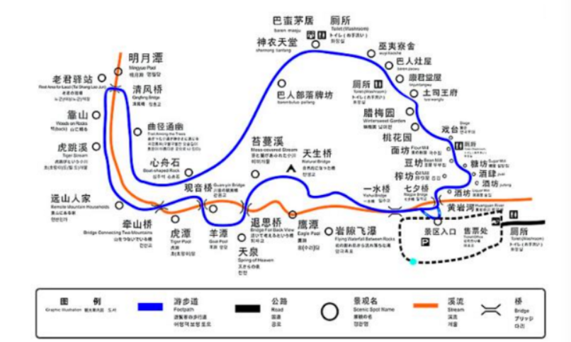

### 神农坛

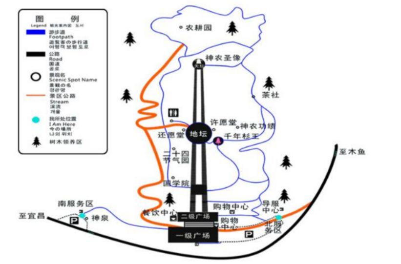

### 官门山

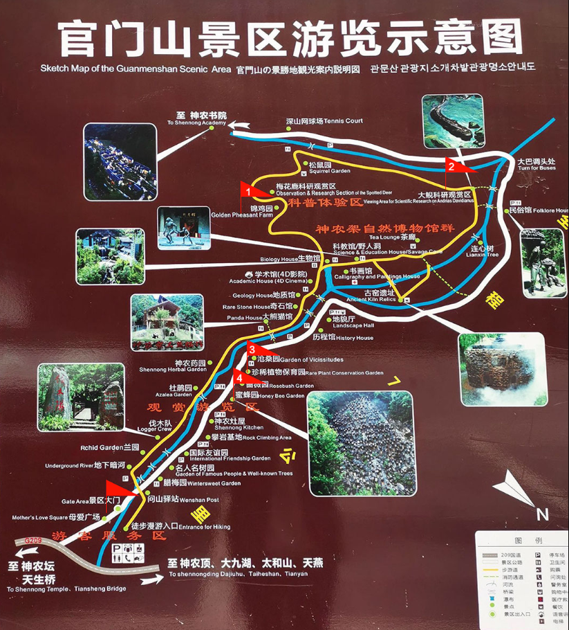

### 天燕景区

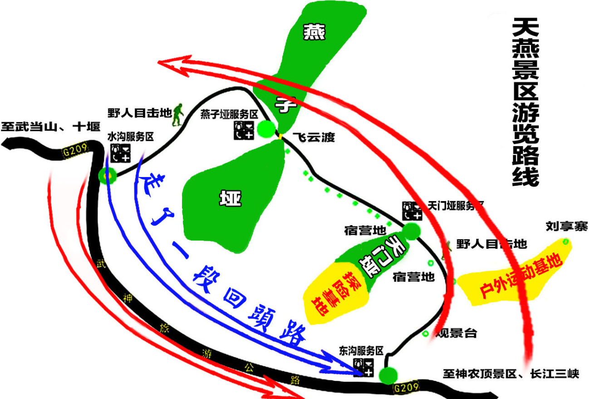

| 途径点            | 游玩时长 | 推荐指数 | 特色                    |
| ----------------- | -------- | -------- | ----------------------- |
| [燕子垭](#燕子垭) | 2.5~3.5  | ✨✨✨      | 燕子洞 , 云天飞渡彩虹桥 |
| [画廊谷](#画廊谷) | 1~1.5    | ✨✨       | 瀑布 , 爬山             |
| [犀牛洞](#犀牛洞) |          | ✨        |                         |

#### 画廊谷

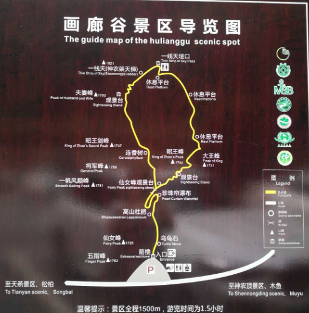

## 住宿

大九湖 : 坪阡古镇

神农顶 : 木鱼镇

天燕 : 松柏镇

## 交通

旅游咨询电话 : 400 994 2333

大九湖客运站 : 13597851493  1998664962  0719-3475999

巴东客运站联系人 : 18872785608（覃师傅）

酒壶坪 (大九湖换乘中心) : 0719-3456086  0719-3475678

神龙架机场 : 0719-3312187

机场大巴 (松柏镇) : 0719-3339977

机场大巴 (木鱼镇) : 0719-3456168

约车电话 : 0719-3300888

拼车司机1 : 13886843780

拼车司机2 : 13597892255 (王)

----

大九湖内**私家车无法进入** , 因此 每人**必须**购买景交车票

大九湖景交车 70 (次日再进 补交 20)

神农顶景交车 60 (固定线路 , 固定景点 , 每个景点游玩时间有限)

----

附近 交通不是很灵活 , 大巴 都是**指定地点**上下车 , 拼车 也只跑**固定路线** , 半途上车 或 下车 依然收取全额费用 , 请自行与司机协商 .

|      |                |                                                              |
| ---- | -------------- | ------------------------------------------------------------ |
| 包车 | 400 ~ 600 / 天 | 司机陪玩 , 送到景区 , 接回酒店 ; 包车最划算的是找几个志同道合的 , 可以自定义游玩路线 , 价格略贵 , 较为灵活 . |
| 拼车 | 100 ~130   /人 | 6:30 ~ 7:10 出发 : 木鱼镇 - 神农 -  大九湖 -木鱼镇 ;  **上午**神农顶 , **下午**大九湖 |
| 拼车 | 100 ~ 120 / 人 | 7:00 ~ 7:30 出发 : 木鱼镇 - 天燕 - 红萍画廊 - 官门山 - 神农坛 - 天生桥 - 木鱼镇 ; **上午**天燕 , **下午**官门山 , 神农坛 , 天生桥 |
| 拼车 | 60 / 人        | 7:00 ~ 7:30 出发 : 木鱼镇 - 天燕 - 红萍画廊 - 木鱼镇 ; **半日游** |
| 拼车 | 50 / 人        | 12:30 ~ 13:30 出发 : 木鱼镇 - 官门山 - 神农坛 - 天生桥 - 木鱼镇 ; **半日游** |
| 拼车 | 30 / 人        | 兴山站 - 木鱼镇客运站                                        |

----

木鱼镇 : **木鱼客运站**

坪阡古镇 : **换乘中心** (地图上看 就在 中国石化大九湖加油站旁边 ) 

松柏镇 : **神农架客运站**

大巴车只在起始客运站停靠

大巴发车时间会有些许浮动 , 多半以相关 高铁列车 班次**动态调整**

|                         |              | 大巴/人 | 大巴发车时间                                               |
| ----------------------- | ------------ | ------- | ---------------------------------------------------------- |
| **机场**                |              |         |                                                            |
| 木鱼镇客运站 - 飞机场   | 1.5 小时     | 50      | 10:30                                                      |
| 松柏镇 - 飞机场         | 2 小时       | 50      | 10:00                                                      |
| **神农架高铁站**        |              |         |                                                            |
| 神农架站 - 松柏镇       | 1 小时       | 20      | 9:30 10:30 11:40 12:40 13:40 15:20 16:20 18:20 20:10 22:00 |
| 松柏镇 - 神农架站       | 1 小时       | 20      | 7:00 8:00 9:20 11:00 12:30 13:30 14:30 15:30 16:30 18:00   |
| 神农架站 - 木鱼镇客运站 | 2.5 ~ 3 小时 | 50      | 11:40 13:40 15:40                                          |
| 木鱼镇客运站 - 神农架站 | 2.5 ~ 3 小时 | 50      | 10:00 15:30                                                |
| **兴山高铁站**          |              |         |                                                            |
| 兴山站 - 木鱼镇客运站   | 1 ~ 1.5 小时 | 25      | 7:30 10:00 11:00 12:00 13:00 14:30 16:00 17:10             |
| 木鱼镇客运站 - 兴山站   | 1 ~ 1.5 小时 | 25      | 7:00 8:30 10:00 11:30 13:00 14:30 16:00 17:30              |
| **巴东高铁站**          |              |         |                                                            |
| 巴东高铁站 - 坪阡古镇   | 1.5 ~ 2 小时 | 45      | 10:30 12:30 15:20 17:00                                    |
| 坪阡古镇 - 巴东高铁站   | 1.5 ~ 2 小时 | 45      | 7:00 9:00 11:00 14:00                                      |
|                         |              |         |                                                            |
| **其他**                |              |         |                                                            |
| 木鱼镇客运站 - 坪阡古镇 | 2 ~ 2.5 小时 | 40      | 7:20 10:30 13:30                                           |
| 坪阡古镇 - 木鱼镇客运站 | 2 ~ 2.5 小时 | 40      | 10:30 13:30 16:00                                          |
| 木鱼镇客运站 - 滑雪场   | 1 小时       |         | 7:30 8:00 9:00 10:00 11:00 13:00 14:00                     |
| 滑雪场 - 木鱼镇客运站   | 1 小时       |         | 12:00 13:00 14:00 15:30 17:30 18:00                        |
|                         |              |         |                                                            |

## 2024-10出游路线

高德地图

